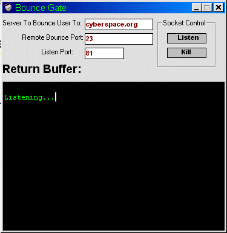



## Bounce Gate\!

### Description

Allows entry from a remote user into your machine then this software bounces them into an unexplored area of the internet(another remote host).
 
### More Info
 
Have standing knowledge of Winsock.

Returns joY!

This bounce gate returns all data sent and retreived from the remote hosts, do not use it to capture password information from a user on his shell.

             |
---                |---
**Submitted On**   |2000-10-30 17:10:42
**By**             |[Alex](https://github.com/Planet-Source-Code/PSCIndex/blob/master/ByAuthor/alex.md)
**Level**          |Advanced
**User Rating**    |4.3 (17 globes from 4 users)
**Compatibility**  |VB 5\.0, VB 6\.0
**Category**       |[Complete Applications](https://github.com/Planet-Source-Code/PSCIndex/blob/master/ByCategory/complete-applications__1-27.md)
**World**          |[Visual Basic](https://github.com/Planet-Source-Code/PSCIndex/blob/master/ByWorld/visual-basic.md)
**Archive File**   |[CODE\_UPLOAD1113510302000\.zip](https://github.com/Planet-Source-Code/alex-bounce-gate__1-12415/archive/master.zip)

